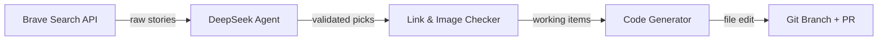

# Vegan News Agent

An automated weekly agent that finds recent positive vegan news, validates the articles and images, and updates the VeganHearts GoodNews feed — all with a single command.

## How it works



1. **Search** — searches Brave for recent (past week/month) positive vegan news across multiple queries
2. **Curate** — the DeepSeek-powered agent picks the 4-6 best stories (diverse categories, uplifting tone, verifiable sources)
3. **Validate** — every image URL is fetched (checking for 200, content-type, and minimum dimensions) and every source URL is verified to return a 200
4. **Generate** — produces the TypeScript code for the new `GoodNewsItem` entries
5. **Integrate & PR** — edits `app/components/GoodNews.tsx`, creates a branch, commits, and opens a PR

## Usage

```bash
# Set up
cd scripts/vegan-news-agent
python3 -m venv .venv
source .venv/bin/activate
pip install -r requirements.txt
cp .env.example .env   # fill in your keys

# Run it
python3 news_agent.py
```

## What it validates

### Images
- HTTP 200 response
- Content-Type is `image/*` (jpeg, png, webp)
- Minimum dimensions: 300×150px
- Visually suitable (checked by the LLM based on URL context — no offensive/adult content)

### Links
- HTTP 200 (or 301/302 that resolve to 200)
- Response body contains the article title or key terms (anti-spam check)
- Domain matches the `sourceName` field

## Environment variables

| Variable | Required | Description |
|---|---|---|
| `BRAVE_API_KEY` | Yes | Brave Search API key |
| `DEEPSEEK_API_KEY` | Yes | DeepSeek API key for Pydantic AI |
| `GITHUB_TOKEN` | Yes | GitHub PAT with `repo` and `contents` scope |
| `GITHUB_REPO` | Yes | e.g. `peterdonaghey/vegan-hearts` |

## Weekly automation (cron)

```cron
# Run every Monday at 9am
0 9 * * 1 cd /path/to/vegan-hearts/scripts/vegan-news-agent && .venv/bin/python news_agent.py
```

Or use a GitHub Action (see `ci.yml` example in the script).
